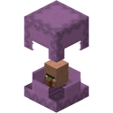
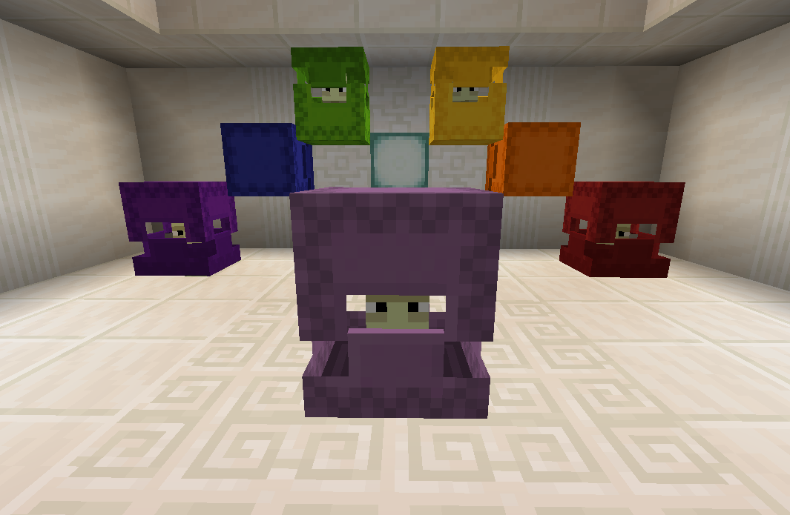

Shulker Shops
=============

This is a Minecraft Forge server-side mod whose aim is to allow player to create currency-less
 (items for items) shops to sell or buy items with other players. A remake of the classic 
 "chest shop" kind of server plugin, but with a villager-like trading interface. And what better
 mod to be a shop clerk that one that's literally a box! [Here's a short video of what it looks like.](https://i.imgur.com/0usOePi.gifv)
 
The mod is currently in a pre-release state and is not recommended for use on a live server.

Usage
=====

/shulker command
----------------

Setting up is done via the `/shulker` command, and all subcommand except for `give` require to select a shop beforehand (see [Selection](#selection)).

General note about specifying items: Wherever you need to specify an item count and/or type, the command allows the `@hand` and `@offhand` specifiers, what's in your main or off hand as bought or sold item (it will come in **hand**y for items with complex data like written books or enchanted weapons). In these cases the specifier will replace both item count and type. You can always change the count afterwards. If you don't use the hand specifiers, then the syntax for item type is the same as for the vanilla /give command, see the [Minecraft Wiki](https://minecraft.gamepedia.com/Commands/give#Examples).

Here's the current subcommands for (`<…>` indicate a parameter, to replace with the value you want without the &lt; &gt;) :
 * `give`: Gives the player one of the mod's specific items. Requires the shulkershop.give_items permission
    * `give selector`: Gives the player the item needed to select shops
    * `give creator`: Gives the player the item needed to create shops
 * `delete`: Remove the selected shop. Will fail if the shop's inventory is not empty
    * `delete force`: Will delete the shop even if its inventory is not empty
 * `set`: Changes the shop's settings:
    * `set name <name>`: Change the shop's name, appearing both above the shulker and in the trading GUI. The given name has to contain the player's name unless they have the `make_anonymous` permission.
    * `set color <color>`: Set the shulker color. Accept any dye color, or "default" for the classic shulker light purple.
 * `offers`: Lists the shop's offers
    * `offers add <bought> <sold> <limit>`: Adds a new offer. <bought> and <sold> are quantity + item (accepts @hand/@offhand). Limit is how many times this offer may be used, or `unlimited`. Uses are limited by the shop's stock but you might want to limit some offer's uses, for instance if you're buying multiple things for the same price and are only interested in a limited amount of each of them.
        * `/shulker offers add 1 diamond 64 minecraft:sea_pickle 10` will add an offer for which players can spend one diamond to get a stack of sea pickles (what a bargain), and the offer may only be used 10 times.
        * `/shulker offers add @hand @offhand` will set the price to what and how many you have in your main hand, and the traded good to what and how many you have in your off-hand
    * `offers edit <id> …`: Edits an offer. The id is the number of the offer in the list
        * `… bought <buy count> <buy item>`: Changes the bought item count and/or type (accepts @hand/@offhand). 
        You can omit the item type if you only want to change the count.
        * `… sold <sold count> <sold item>`: Changes the sold item count and/or type (accepts @hand/@offhand). 
        You can omit the item type if you only want to change the count.
        * `… limit …`: Changes the use limit of the offer. There are multiple ways to specify the limit:
            * `… <limit>`: Sets the offers's *remaining uses* to &lt;limit&gt;, e.g the actual limit will be the current number of uses + &lt;limit&gt;
            * `… unlimited`: Sets the offer's use limit to unlimited
            * `… set <limit>`: Set the current limit to &lt;limit&gt;.
            * `… add <limit>`: Adds &lt;limit&gt; to the current value, &lt;limit&gt; may be negative to remove uses.
    * `offers delete <id>`: Deletes the specified offer

Mod concepts
------------

### Selection

Editing a shop requires selecting it. This is done by sneaking and right-clicking on the shulker with the configured "edit" item (default: a torch). While a shop is selected, other players can't open the shop's trading interface, inventory or select the shop themselves. Selecting another player's shop requires having either the `shulkershop.others.edit` or `shulkershop.others.delete` permission.

Opening your shop's inventory is done by right-clicking with the "edit" item on a shulker *without* sneaking. This will also select the shop so that other players can't interact with it while you're editing the stock.

Selections will time-out after 5 minutes without interaction with the shop.

### Use limit

You may set a use limit on offers to specify how many times they can be used. You can of course also limit an offer's max uses by limiting the stock of the item you're selling in the shop's inventory, but that might not be possible to do individually if several offers sell the same type of item (typically, if your shop buys items for some currency, e.g diamonds). Example: you have 3 offers for buying different items for 1 diamond each, you put 30 diamonds into your shop's inventory and set a limit of 10 on each offer. That way, none of the offers can sell out all the diamonds before the others can be used.

Config
======

The mod has two configurable items: the item to select shops, and the one to create them. By default the first one is just a regular stick, and the second one is a banner pattern with a custom name, description ("lore") and a fake enchantment tag for the visual effect. Be careful not to put a basic items with no tags for shop creation, as this behaviour will occur whenever the player right clicks the ground with it. 
    
### Permissions

This mod defines a number of permissions. Asterisks* means they are restricted to ops by default. You can manage those permissions via the config file (shulkershop-server.toml). Values corresponds to the minimum user permission level, which is 0 for normal users and "op-permission-level" (in settings.properties, default = 4) for ops. See [op-permission-level](https://minecraft.gamepedia.com/Server.properties#op-permission-level).
 
 * `create`: Create a shulker shop using the creator item
 * `own.inventory`: Access your shop's inventory (mainly exists for consistency with .others.inventory)
 * `own.delete`: Delete your shop
 * `own.edit`: Edit your shop's settings and offers
 * `others.inventory`⚠️, `.delete`⚠️, `.edit`⚠️: Same as above but for another player's shop
 * `change_owner`⚠️: Change a shop's owner. Useful for creating a shop for another player as an operator.
 * `make_anonymous`⚠️: Allow giving names to shops that do not contain your username. As of now this is the editor's name, not the owner's, therefore it only makes sense for one's own shops.
 * `give_items`⚠️: Use the /shulker give command
 * `force_delete`⚠️: Force-delete a shop, allowing to delete shops with non-empty inventories.